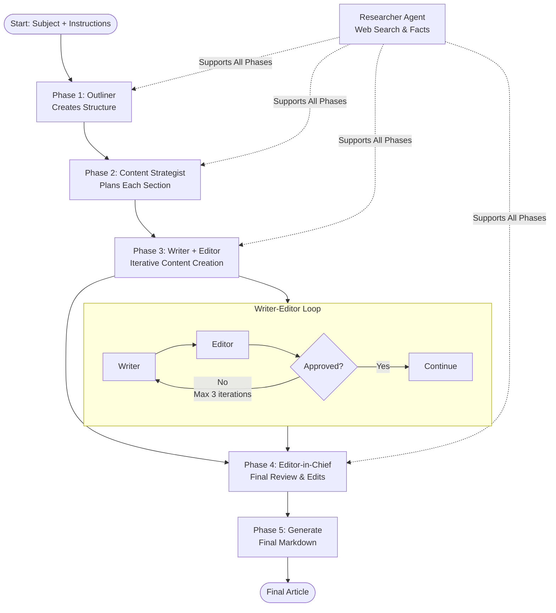

# AI Writer

I built this multi-agent AI writing system in just a few days to see if I could recreate a newsroom workflow using AI. Give it a topic, and it orchestrates five specialized AI agents to research, plan, write, edit, and polish a complete article - just like a real editorial team.

## Input & Output

### Input
- **Subject**: The topic or theme for the article
- **Custom Instructions**: Optional guidelines including:
  - Tone & style preferences
  - Target word count
  - SEO keywords
  - Specific formatting requirements

### Example
```typescript
await writeArticle({
  subject: "The Future of AI in Healthcare",
  customInstructions: `
    - Tone: Informative and engaging
    - Length: ~800 words
    - Keywords: AI, healthcare, future, medical technology
    - Format: Fast Company publication style
  `
});
```

### Output
- Complete article with optimized title
- Structured markdown content
- Cost tracking and usage analytics
- Comprehensive logging of the generation process

## Architecture

The system employs a **5-phase collaborative workflow** with specialized AI agents:

### Agents
- **Outliner** (OpenAI o1): Creates hierarchical article structure
- **Content Strategist** (OpenAI GPT-4o): Develops detailed section plans and key points
- **Writer** (OpenAI GPT-4o): Transforms plans into polished content
- **Editor** (OpenAI GPT-4o): Reviews and refines content through iterative feedback
- **Editor-in-Chief** (OpenAI o1): Performs final review and applies editorial improvements
- **Researcher** (OpenAI GPT-4o-mini + Tavily): Provides fact-checking and web research support

### Workflow



## Technical Implementation

### Stack
- **TypeScript** with full type safety
- **AI SDK** for multi-provider LLM integration
- **Tavily API** for web search capabilities
- **Jina Reader** for URL content extraction
- **Zod** for runtime validation

## Usage

```bash
# Install dependencies
pnpm install

# Run the article generator
pnpm dev
```

## Further Development

### High Priority
- [ ] **Content Quality**: Integrate plagiarism detection (Winston AI, Copyleaks, or GPTZero)
- [ ] **SEO Optimization**: Analyze top-ranking articles and incorporate keyword strategies
- [ ] **Model Flexibility**: Add new SOTA models to the system (Claude 4, o3, Gemini 2.5 etc.)
- [ ] **Research Enhancement**: Implement embedding-based web search caching for efficiency

### Medium Priority
- [ ] **User Experience**: Add web interface for article generation and customization
- [ ] **Workflow Customization**: Allow selective agent usage (e.g., skip content strategist for simple articles)
- [ ] **Human-in-the-Loop**: Feedback system for editorial review stages
- [ ] **Advanced Search**: Integrate Brave Search, Exa, or Serper.dev for improved research quality

### Low Priority
- [ ] **Prompt Optimization**: A/B testing framework for agent prompt improvement
- [ ] **Custom Instructions**: Smart routing of instructions to relevant agents only
- [ ] **Editor-in-Chief Protocol**: More granular edit operations (add, remove, restructure sections)

### Research & Investigation
- [ ] **Agent Necessity Review**: Evaluate if Content Strategist provides sufficient value vs. complexity
- [ ] **Alternative Architectures**: Explore agent-less approaches or different collaboration patterns
- [ ] **Quality Metrics**: Implement automated content quality scoring and optimization

---

*Built with ❤️ during a hackathon to explore the future of AI-powered content creation.*